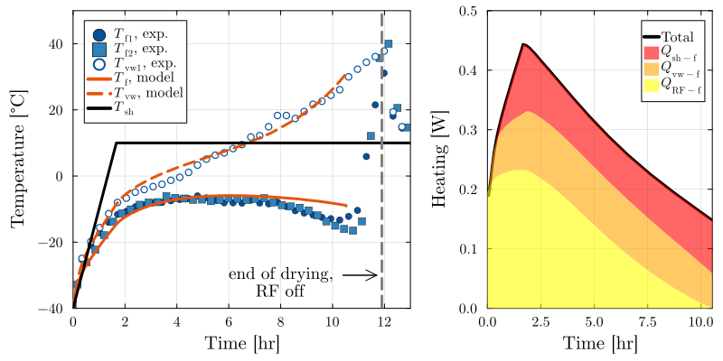

# Case M1

This folder contains raw experimental data for case M1 from the microwave-assisted lyophilization experiments discussed in the manuscript. 

`Mannitol_5mL_TEMP.csv` contains the process data recorded by the lyophilizer; since this was a microwave cycle, traditional thermocouples could not be used, and temperatures were logged on a separate computer.
`TemperatureLog_030223.csv` contains the fiber optic probe measurements of temperature, recorded from roughly the same time the cycle data logging began, although not exactly. 

## Figure 
The following figure, reported in the article as Figure 17 (in the appendix), shows the primary drying portion of this experiment and a model fit.

