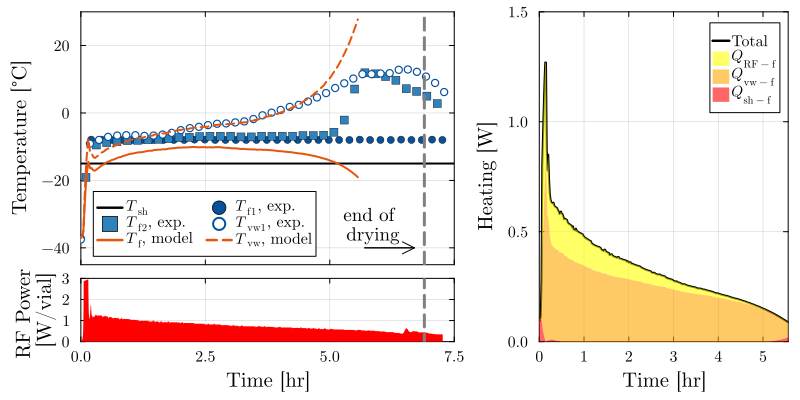

# Case M3

This folder contains raw experimental data for case M3 from the microwave-assisted lyophilization experiments discussed in the journal article. 

`CL_2_21_5M.csv` contains the process data recorded by the lyophilizer; since this was a microwave cycle, traditional thermocouples could not be used, and temperatures were logged on a separate computer. Microwave power was varied according to a closed loop PI control scheme, and recored separately in `PowerMeter_21Feb2023.csv`.
`TemperatureLog_030223.csv` contains the fiber optic probe measurements of temperature, recorded from roughly the same time the cycle data logging began, although not exactly. 

To see how this data was postprocessed before model fitting, see `scripts/postprocess_sugars.jl`.

## Figure 
The following figure, reported in the article as Figure 19 (in the appendix), shows the primary drying portion of this experiment and a model fit.

