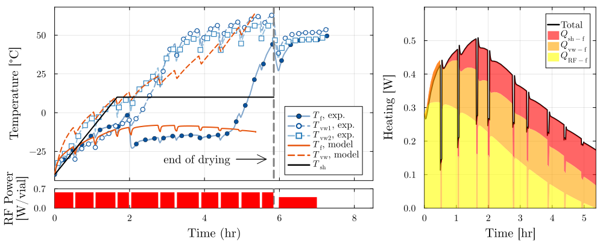

# Case M4

This folder contains raw experimental data for case M4 from the microwave-assisted lyophilization experiments discussed in the journal article. 

`2023-02-09-09_LS_AD_1.csv` contains the process data recorded by the lyophilizer; since this was a microwave cycle, traditional thermocouples could not be used, and temperatures were logged on a separate computer. 
`2023-02-09-09_LS_AD_2.csv` contains the fiber optic probe measurements of temperature, recorded from roughly the same time the cycle data logging began, although not exactly. 
`2023-02-09-09_LS_AD_3.csv` contains measurements on the outside of the vial, measured with a flexible multipoint temperature probe similar to that in [https://doi.org/10.3389/fchem.2018.00288](https://doi.org/10.3389/fchem.2018.00288), with five temperature readings up the side of the vial.

The microwave power was intermittently turned off manually, at approximately half hour intervals (but irregularly), to prevent overheating of the microwave generation apparatus. The timing was not precisely recorded but can be deduced from the sawtooth swings in temperature.

To see how this data was postprocessed before model fitting, see `scripts/postprocess_sugars.jl`.

## Figure 
The following figure, reported in the article as Figure 13, shows the primary drying portion of this experiment and a model fit.

This folder contains raw experimental data for case M4 from the microwave-assisted lyophilization experiments discussed in the manuscript. This case used manual microwave power cycling, and the folder includes the temperature logging data used for model comparison.

## Figure Placeholder

Add a representative schematic or reproduction of this experimental case here.
