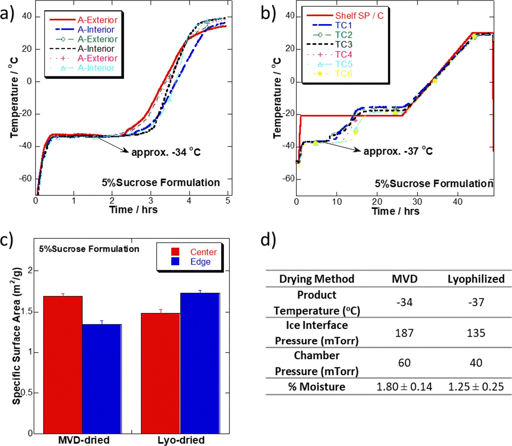

# Bhambhani 2021, Figure 5

This folder contains digitized temperature data from Figure 5 of the following paper:

Bhambhani, A., Stanbro, J., Roth, D., Sullivan, E., Jones, M., Evans, R., & Blue, J. (2021). Evaluation of Microwave Vacuum Drying as an Alternative to Freeze-Drying of Biologics and Vaccines: The Power of Simple Modeling to Identify a Mechanism for Faster Drying Times Achieved with Microwave. AAPS PharmSciTech, 22(1), 52. [https://doi.org/10.1208/s12249-020-01912-9](https://doi.org/10.1208/s12249-020-01912-9)

The file `T_a_A-Exterior.csv` is taken from the red experimental trace of panel (a), and `T_a_A-Interior.csv` is from the blue trace of panel (a). `T_b_TC1.csv` and `T_b_TC5.csv` are likewise the blue and pale blue traces of panel (b). 

## Figure

The original figure is:

The replotted version with model fit, noting that the left (conventional) is panel (b) of the original and the center (microwave) is panel (a) of the original:
