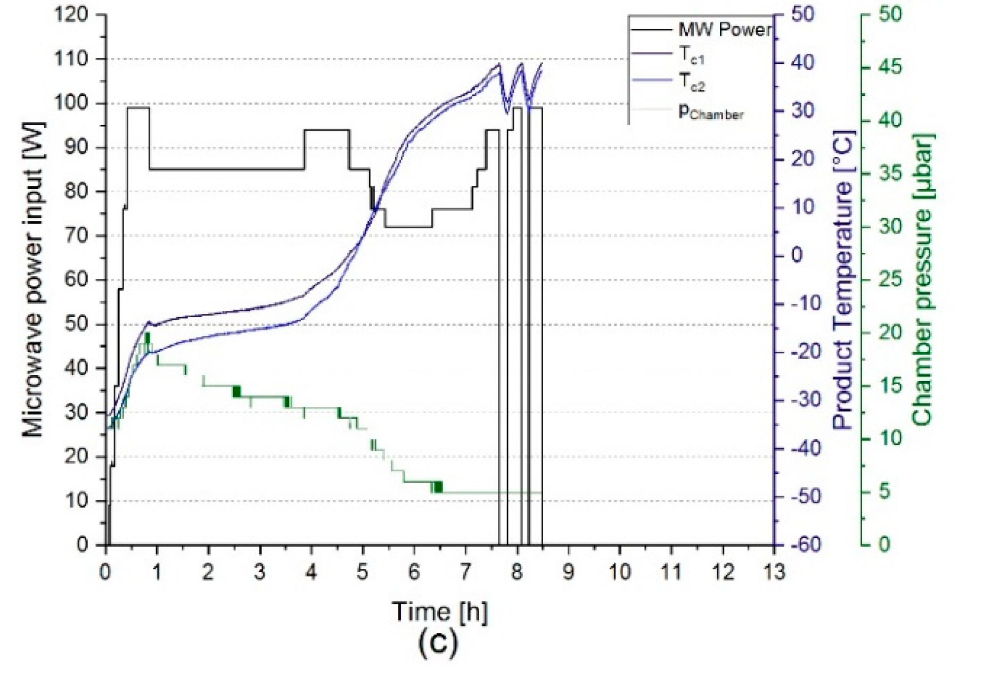
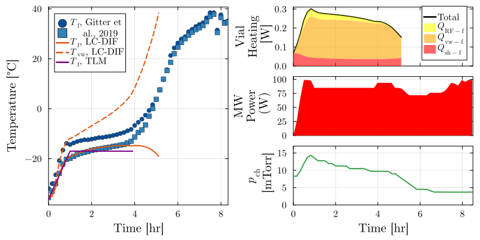

# Gitter 2019, Figure 1c

This folder contains digitized traces, including microwave power, chamber pressure, and temperature, from Figure 1c of the following paper:

Gitter, J.H.; Geidobler, R.; Presser, I.; Winter, G. Microwave-Assisted Freeze-Drying of Monoclonal Antibodies: Product Quality Aspects and Storage Stability. Pharmaceutics 2019, 11, 674. [https://doi.org/10.3390/pharmaceutics11120674](https://doi.org/10.3390/pharmaceutics11120674)

Note that the chamber pressure here is measured only via a Pirani gauge, which is sensitive to gas composition (and commonly exploited to detect the end of primary drying, when it typically converges to pressure measured by a capacitance manometer).

## Figure 

This is the original figure, cropped but with resolution unchanged:

Here is the replotted version for this journal article, with model fit:

